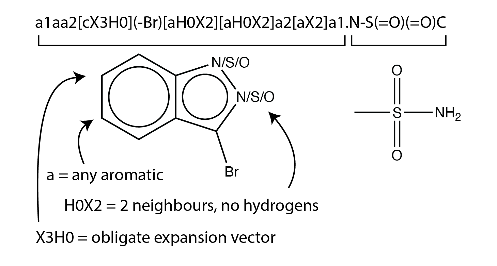
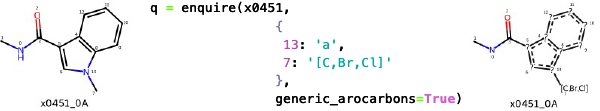

# Arthorian Quest

> :construction: This is a work in progress. :construction:

An experiment in using Arthor (arthor.docking.org) by [NextMove Software](https://www.nextmovesoftware.com/)
and filtering the results with Fragmenstein,
in order to enumerate linkers of two hits, via a SMARTS pattern.

The key principle is that the SMARTS pattern can be both ambiguous and a disconnected,
thus allowing linkers to be searched for.
By creating a SMARTS pattern with a wished for expansion vector, one can search for linkers that connect two hits.

To whittle out impossible compounds, the results are filtered by 3D constrained conformer generation via Fragmenstein,
but using the SMARTS pattern making it lightning fast.

Step:

1. Generate a SMARTS pattern that reflects one's wishes for a molecule
2. Enumeration of possible compounds via Arthor
3. Filtering by 3D constrained conformer generation via Fragmenstein
4. Placement via Fragmenstein

## Install

```bash
pip install arthorian-quest
```

## Generate ambiguous SMARTS

In a SMARTS pattern an atom can be an element like a SMILES with explicit hydrogens,
say `[CH2]`, but can also be a comma separated list of alt elements say `[CH2,NH2]` (or better `[C,N;H2]`,
and number of interactions can can be specified with "X", say `[CH2X4]` means the carbon has 2 hydrogens and 4 connections.
If these are not specified, you have got yourself a connection vector, eh.
NB. In Arthor, the lowercase and uppercase R notations are best ignored.



The function `enqire` in [create.py](arthorian_quest/create.py) is intended to convert a regular `Chem.Mol`
to one that encodes SMARTS patterns (i.e. by having not `Chem.Atom` but `Chem.QueryAtom` instances).

```python
from arthorian_quest import enquire
from rdkit import Chem

mol: Chem.Mol = Chem.MolFromSmiles('c1cnccc1')
query: Chem.Mol = enquire(mol, {2: '[c,n]'})
print( Chem.MolToSmarts(query) )
```
will return `'[c&H1]1:[c&H1]:[c,n]:[c&H1]:[c&H1]:[c&H1]:1'`

See its docstring for more details.



To visualise the molecule as 2D `show_experiment` will do
```python
query: Chem.Mol

from arthorian_quest import show_experiment

show_experiment(query, 'Trying a pyridine')
```

To visualise better using SMARTSviewer (ZBH Center for Bioinformatics, University of Hamburg)

```python
from arthorian_quest import retrieve_smartsplus
import PIL
from rdkit import Chem

query: Chem.Mol
image: PIL.Image = retrieve_smartsplus( query )

image
```

There is a `Shorthands` enum with a few values:

```python
from arthorian_quest import Shorthands

print(Shorthands.HALOGEN)  # [F,Cl,Br,I]
print(Shorthands.ALIPHATIC_DONOR)  # [N,O,S;!H0;v3,v4&+1]
...
```

To remove an atom pass a value of '' (or `Shorthands.DELETE`) to the replacement map.

Note 1. ``atom.GetSmarts()`` is a method, but it could return '[N+]' already,
which is complicated to deal with as appending at given positions may muck things up.
And certain SMILES are not legal, for example 'CC[O+H2]' should be 'CC[OH2+]'

## Find hits

Querying [Arthor](arthor.docking.org) is simple and
is documented in the [Arthor API page](https://arthor.docking.org/api).

Nothing interesting here code-wise,
except the trick that the SMARTS can be a disconnected compound,
say `'C[OH1].NC(=O)N'`,
which is the basis for this whole project.

```python
from arthorian_quest import QueryArthor
from IPython.display import display
import pandas as pd

# ---- Available databases ----
display(QueryArthor().dbs)

# ---- Get query results ----
query='[aH0X3]([#6,#7,#8])1[c,n](-[Br,Cl,NH2])[aH0X2][aH0X2]a1.N-S(=O)(=O)-C'
results: pd.DataFrame = QueryArthor().retrieve(query=query, QueryArthor.enamine_dbs)
```

## Filtering by 3D

This part uses Fragmenstein (github.com/matteoferla/Fragmenstein) to generate conformers.

### Simple

`SmartMonsterHandler` is not a subclass of Monster. As I mean to make it more in line with `Victor`.

A new monster object is created for each molecule because otherwise the parameters linker and cause interference.

There is something annoying that happens. The SMARTS pattern generated mapping may be poisonous, so gets ignored.
This is bad. As a result a check happens to prevent this. `monster.convert_origins_to_custom_map()` will have neg indices,
i.e. ignore this atom. When a molecule is ignored it's values are marked as failed.

```python
from arthorian_quest import SmartMonsterHandler
import pandas as pd

query: Chem.Mol = ...
matches: pd.DataFrame = ...
results = matches.mol.apply(SmartMonsterHandler([x1594, fippedSulfonamide], query, joining_cutoff=10))
matches['success'] = results.loc[~results.isna()].apply(operator.itemgetter('success'))
matches['ddG'] = results.loc[~results.isna()].apply(operator.itemgetter('ddG'))
matches['minimized_mol'] = results.loc[~results.isna()].apply(operator.itemgetter('mol'))
```

## Pipeline
If you are feeling bold try `run_experiment`.
But do note that you might get too many for reason or none.
Getting a SMARTS pattern perfect is not trivial, so it may be needed to try a few times,
before running the placements.

```python
from arthorian_quest import enquire, create_laboratory_df, assess_experiment
import pandas as pd
from rdkit import Chem
from fragmenstein import Laboratory, Wictor
# do whatever fix, eg.
# change parser to Without PyRosetta Victor (quicker)
Laboratory.Victor = Wictor

template_mol: Chem.Mol = ...
query_mol: Chem.Mol = enquire(template_mol, ...)
pdb_block: str = ...

analogs: pd.DataFrame = create_laboratory_df(query_mol, template_mol, experiment_name='experiment 123')
print(f'{len(analogs)} analogues found')
# check it works
assess_experiment(query_mol, template_mol, pdb_block)
```


## Etc.

## To do

* What happens when one submits a query that is always false?
* Make a better SMARTS generator
* Checks...
